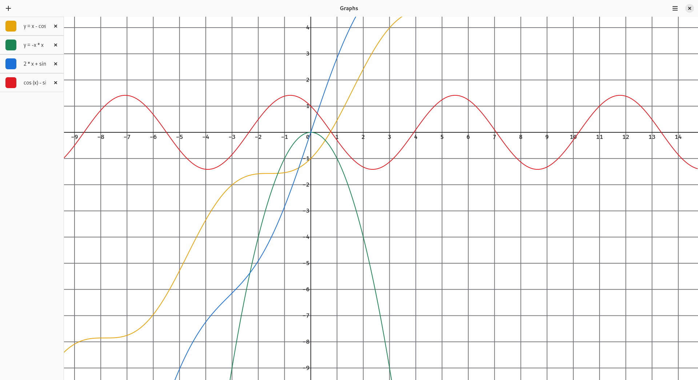
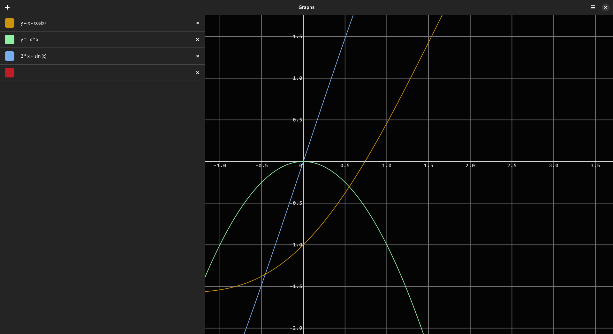

Graphs

## Overview





Graph calculator

## Build and installation

There are 2 ways:

### Meson

    meson setup build
    meson compile -C build
    meson install -C build

### Flatpak

    flatpak-builder build oop.my.graphs.json
    flatpak-builder --user --install --force-clean build oop.my.graphs.json

## Run

Click on icon with `oop.my.graphs` name. Or, to run from the command line, use one of the following commands, depending on how the application was installed.
```
flatpak run oop.my.graphs
```
```
oop.my.graphs
```

## Run tests

    node --experimental-detect-module test/test.js